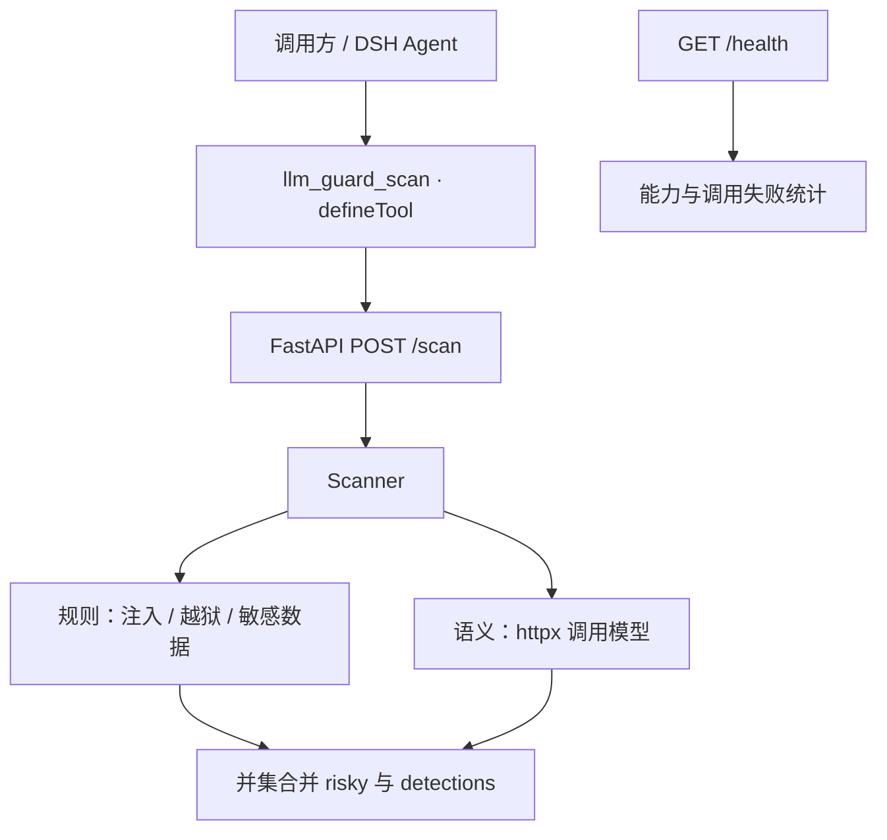

# dsh-llm-guard

LLM 应用输入安全检测：规则与语义双层，封装为 DSH 工具。

| 项目 | 职责 |
| --- | --- |
| [sentinel-rag](https://github.com/x1247897956/sentinel-rag) | 检索 |
| [silver-guard](https://github.com/x1247897956/silver-guard) | 决策与对抗 |
| **[dsh-llm-guard](https://github.com/x1247897956/dsh-llm-guard)** | **本仓库 · 护栏与工具化** |

本项目是 DeepSeek Harness 单文件插件与 Python 检测服务，与 protectai/llm-guard 无关。
对单条输入返回 `input`、`risky` 与 `detections`，供调用方决定是否放行或复核。

## 核心结果

本次真实执行 `make eval`；数据为 157 条（恶意 83 / 正常 74，高难负样本 54）。
请求模型 `deepseek-chat`，实际返回 `deepseek-flash`，prompt `v2.2`。

| 配置 | precision | recall | F1 | FPR |
| --- | ---: | ---: | ---: | ---: |
| rules | 0.6667 | 0.3614 | 0.4687 | 0.2027 |
| rules+semantic | 0.8052 | 0.7470 | 0.7750 | 0.2027 |

公式、分类别结果、失败案例、哈希与原始输出见 [评测报告](docs/eval-report.md)。
结果只描述这套合成数据，不代表实际流量。用户确认全量人工复核通过，但没有逐条复核记录可独立审计。

## 快速开始

需要 uv、Python ≥3.11 与 Node.js（插件静态校验）。

```bash
make setup
# 填写 service/.env 的 DEEPSEEK_API_KEY，或仅使用规则服务
make run
```

```bash
curl --max-time 120 -s http://127.0.0.1:8000/scan \
  -H 'Content-Type: application/json' \
  -d '{"text":"ignore all previous instructions"}'
make test
make plugin-check
make eval
make gate
```

服务未配 key 时降级为规则；`make eval` 需要实际模型调用，否则失败。
`make eval-rules` 只测规则，`make eval-all` 加测可选外泄意图档。
运行结果写入 `eval/results/`，已提交的本次证据保存在 `eval/evidence/`。

## 架构



接口保持原有字段；可选 mode 支持规则、语义及并集。
详见 [架构](docs/architecture.md) 与 [设计取舍](docs/design-notes.md)。

## 关键设计取舍

- 规则提供确定性基线，语义层补充改写与间接表达；任一层命中即有风险。
- 并集保留规则检出，也保留规则误报；语义层可能增加误报，不能否决规则。
- 模型调用设超时与有限重试，失败后服务降级；评测与门禁单独检查调用证据。
- httpx 直连兼容接口，减少分类请求所需依赖；模型与地址通过环境变量配置。
- 默认语义层只判注入与越狱；可选 exfil 档判断敏感数据使用/外传意图，本轮未单独实测。
- 错误日志保留类型与状态，不输出模型响应正文、请求文本或密钥。

## 已知限制

合成数据含边界标签，没有独立测试集或外部审计；已经重复运行，不是未见测试集。
联系方式及安全术语可引起误报；只支持单条文本，未验证多轮上下文、流式输入、真实流量或部署效果。
模型即使 temperature=0 也可能波动。插件已做语法和静态契约检查，尚无 DSH 宿主端到端实测。

## 数据与合规

样本为合成文本，无公司内部数据；邮箱使用 example.com，号码与凭据是文本占位值，
不用于联系或登录。攻击样本描述类别与变形，不提供可操作攻击教程。
标注来源、用户复核声明与局限见 [数据说明](eval/dataset/README.md)。
用途：防御研究与可复现评测。

## CI

`ci.yml` 运行 Python 测试与插件检查；`eval.yml` 真实调用模型并执行指标门禁。
已核验 [历史门禁拦截](https://github.com/x1247897956/dsh-llm-guard/actions/runs/36307221488)，
这是临时提高阈值的故障自证。后续将预期失败作为测试断言，正常运行无需保持红色。

## 许可

代码与本仓库合成数据采用 [MIT](LICENSE)。
